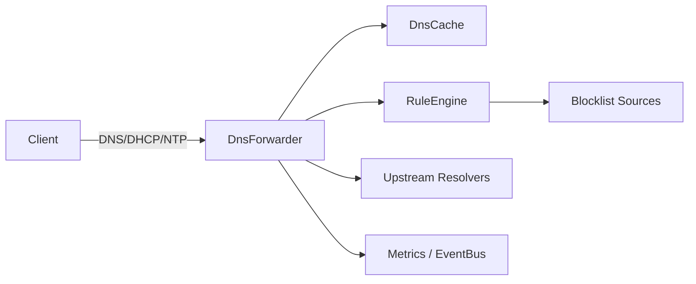
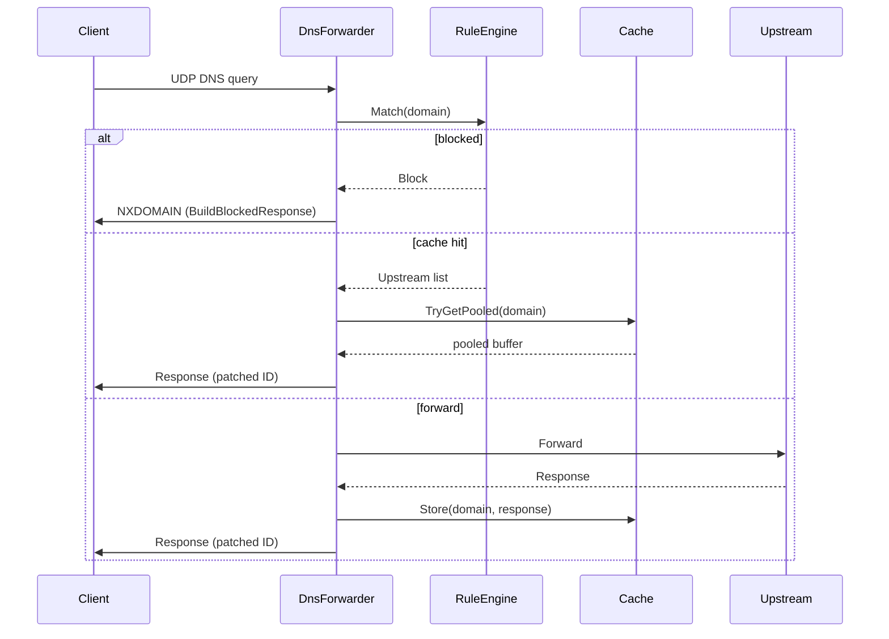
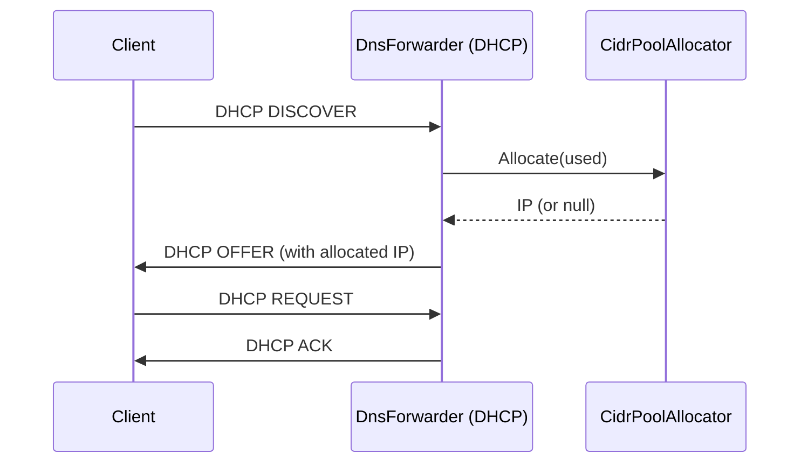
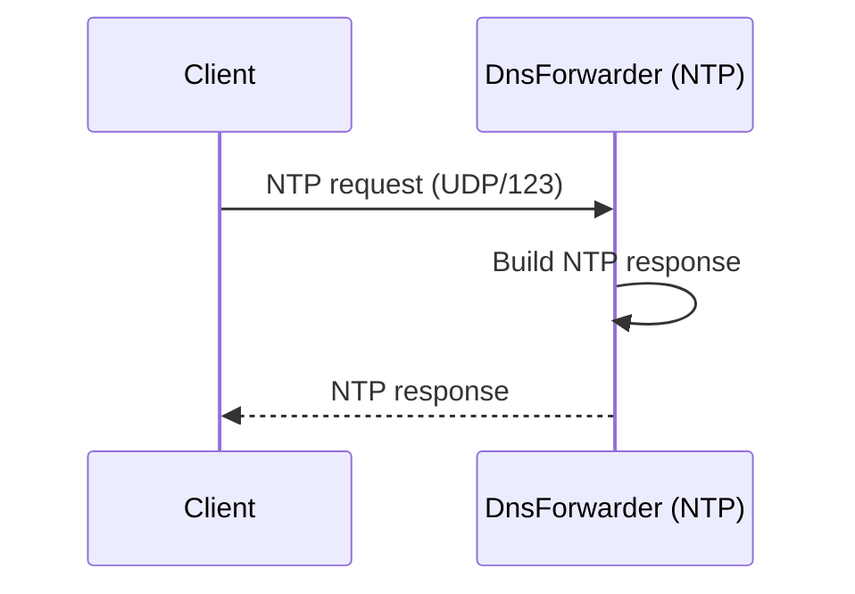

# Architecture & Flow Diagrams

Below are simple mermaid diagrams illustrating the high-level architecture and request flows for DNS, DHCP and NTP.

## High-level component diagram

## DNS request sequence

## DHCP flow (simplified)

## NTP flow (simplified)

