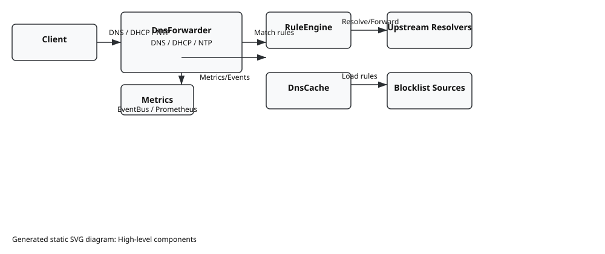
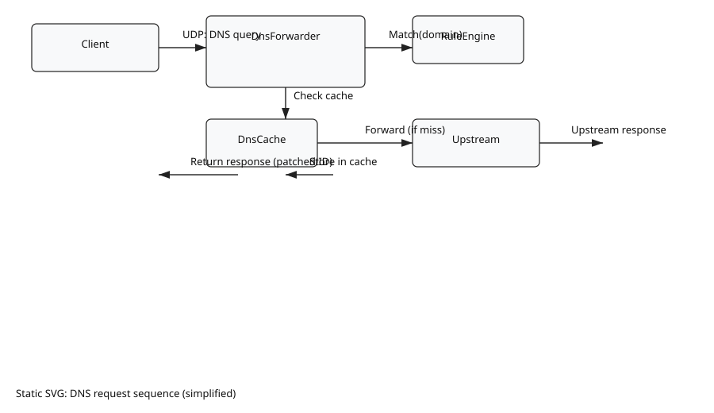
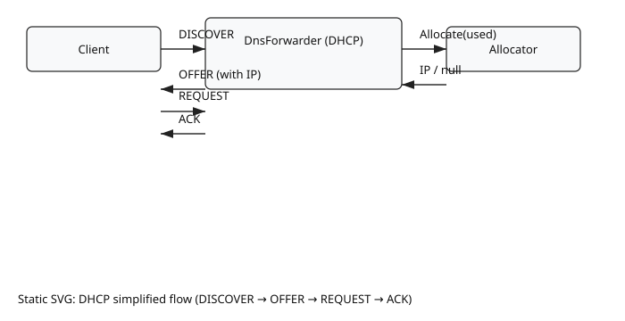
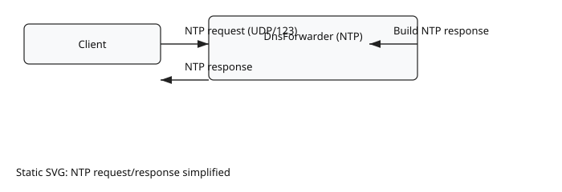

# Diagrams

This directory contains static SVG exports of the repository's architecture and flow diagrams for offline browsing.

## Components

High-level component diagram showing Client, DnsForwarder, RuleEngine, DnsCache, Upstreams, Blocklist Sources and Metrics.

## DNS Sequence

Simplified DNS request sequence (client → forwarder → match → cache/upstream → response).

## DHCP Sequence

Simplified DHCP sequence (DISCOVER → OFFER → REQUEST → ACK) and allocator interaction.

## NTP Sequence

Simplified NTP request/response flow.

